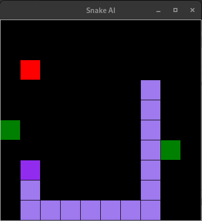
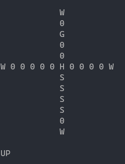
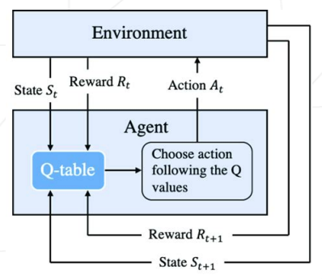

# Snake AI using Reinforcement Learning (Q-Learning)

## I - Environment

The environment of the snake is represented by the board. The following rules apply to the board:

 - Board size: 10 cells by 10 cells.
 - Two green apples, in a random cell of the board.
 - One red apple, in a random cell of the board.
 - The snake starts with a length of 3 cells, also placed randomly and contiguously on the board.
 - If the snake hits a wall: Game over, this training session ends.
 - If the snake collides with its own tail: Game over, this training session ends.
 - The snake eats a green apple: snake’s length increase by 1. A new green apple appears on the board.
 - The snake eats a red apple: snake’s length decrease by 1. A new red apple appears on the board.
 - If the snake’s length drops to 0: Game over, this training session ends

The display of the board look like this:

  

 - Green: green apple
 - Red: red apple
 - Purple: snake

## II - State

Snake vision: The snake can only see in the 4 directions from its head. The following figure represents the terminal output that the program will compute, before asking the agent where the snake should move to. This output is matching the board representation from the previous figure.

  

In this figure, each letter has of course a specific meaning:
 - W = Wall
 - H = Snake Head
 - S = Snake body segment
 - G = Green apple
 - R = Red apple
 - 0 = Empty space

## III - Action

The agent can only perform 4 actions **(UP, LEFT, DOWN, RIGHT)**. It must take
decisions solely based on the snake vision (State), from the head and to the 4 directions.
No other information from the board should be used by the agent.

## IV - Rewards

The goal of the snake is to reach at least a length of 10 cells, and stay alive as long as possible. The action chosen by the agent will evolve through time in order to reach this goal, based on rewards granted by the environment (or board) after each action.

It’s up to us to define the positives and negative rewards. An obvious approach could be:
 - If the snake eats a red apple: a negative reward.
 - If the snake eats a green apple: a positive reward.
 - If the snake eats nothing: a smaller negative reward.
 - If the snake is Game over (hit a wall, hit itself, null length): a bigger negative
reward.

The reward for each action will increase or decrease the chance for the agent to make
the same choice in the future when facing an identical situation.

## V - Q-Learning

  

I implement a model that uses a Q function to evaluate the quality of an action
in a specific state. This Q function is implemented using Q-values in a Q-table.

### Updating the Q function
The Q-learning algorithm is designed to adjust the Q function (and the associated Q-values) based on the reward received after each action taken. We can train mutiple models using different update approaches for the Q function.

### Exploration vs Exploitation
To discover new actions that might be beneficial, the agent sometimes needs to take random actions instead of always choosing the ones that seem to be the best.

### Iterative learning
The agent repeats this process of interacting with the environment, taking actions, receiving rewards, and updating the Q function iteratively. When
the training session is over, a new training session is started to continue the reinforcement learning.

### Export and import models
At any time, it is possible to export a unique file that contains everything describing the current learning state of the agent. This file will mostly
contains the Q-values. The same file can be imported by the agent to restore its learning state to a specific level. Each file is a “model” of your AI. Several models are available in the models folder.

### Exploitation without learning
A configuration switch of the agent will prevent the learning process from happening. The agent will just ignore reward from the board and the Q function will not be updated. This option is usefull to evaluate the success rate of
a specific model without altering it.